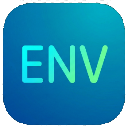

# WinEnv - Windows 环境变量管理工具

<p align="center">
  
</p>

<p align="center">
  <strong>一款现代化的 Windows 用户环境变量管理工具</strong>
</p>

## ✨ 功能特性

- 🔍 **实时搜索** - 快速过滤查找环境变量
- ➕ **添加变量** - 轻松创建新的用户环境变量
- ✏️ **编辑变量** - 双击或按钮修改变量名称和值
- 🗑️ **删除变量** - 安全删除不需要的环境变量
- 🔄 **一键刷新** - 重新加载最新的环境变量列表

## 🎨 界面特点

- 现代深色主题设计
- 毛玻璃效果背景
- 自定义无边框窗口
- 流畅的悬停和选中动画

## 🛠️ 技术栈

| 技术 | 版本 |
|------|------|
| .NET | 10.0 |
| WPF | Windows Presentation Foundation |
| 架构 | MVVM |

## 📦 安装运行

### 环境要求
- Windows 10 或更高版本
- .NET 10 SDK

### 运行方式

```powershell
# 克隆仓库
git clone https://github.com/wild-land/winenv.git
cd winenv

# 运行程序
dotnet run
```

### 发布独立应用

```powershell
dotnet publish -c Release -r win-x64 --self-contained
```

## 📸 截图


## 📄 许可证

MIT License

## 🤝 贡献

欢迎提交 Issue 和 Pull Request！
